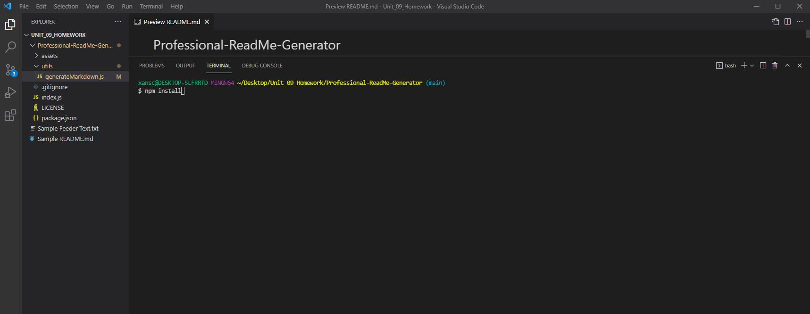
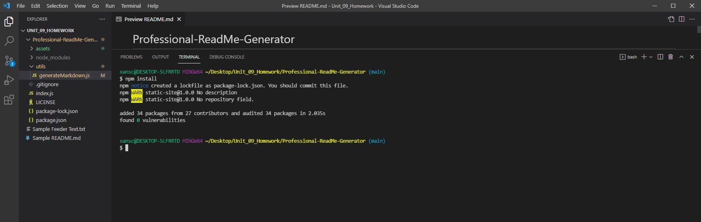
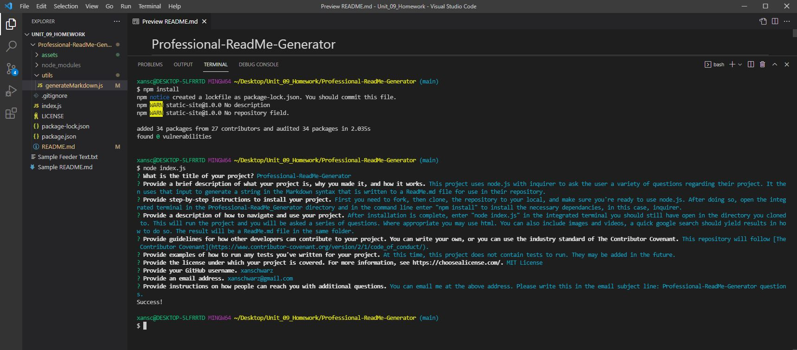
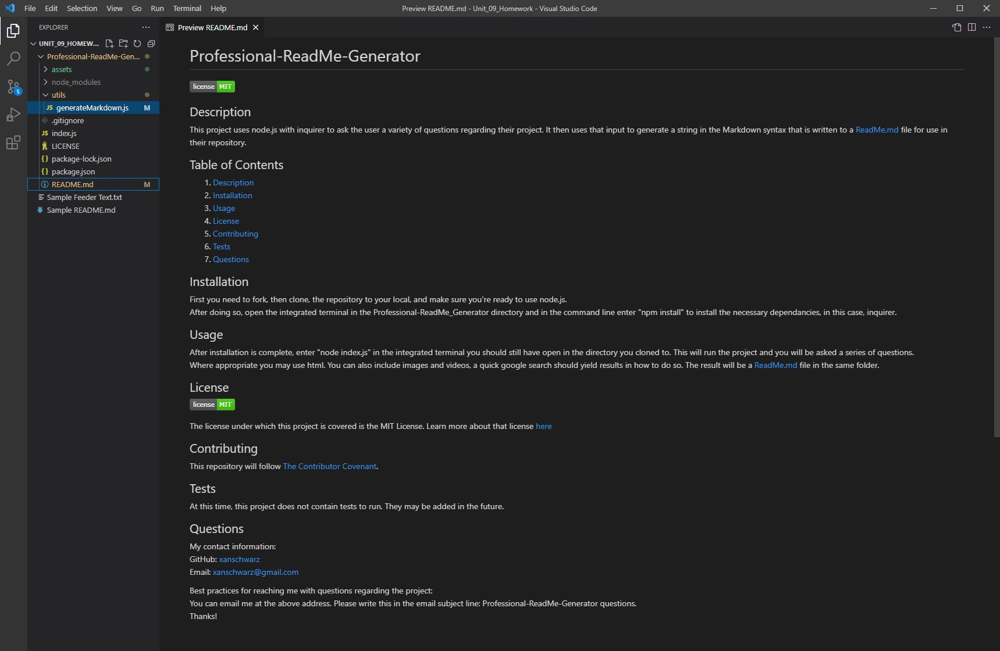

# Professional-ReadMe-Generator

## Description

This project uses node.js with inquirer to ask the user a variety of questions regarding their project. It then uses that input to generate a string in the Markdown syntax that is written to a ReadMe.md file for use in their repository.

## Table of Contents

1. [Description](#description)
2. [Installation](#installation)
3. [Usage](#usage)
4. [License](#license)
5. [Contributing](#contributing)
6. [Tests](#tests)
7. [Questions](#questions)

## Installation

First you need to fork, then clone, the repository to your local, and make sure you're ready to use node.js. After doing so, open the integrated terminal in the Professional-ReadMe_Generator directory and in the command line enter "npm install" to install the necessary dependancies, in this case, inquirer. See the following section for a video of the installation and usage.

## Usage

After installation is complete, enter "node index.js" in the integrated terminal you should still have open in the directory you cloned to. This will run the project and you will be asked a series of questions. Where appropriate you may use html. You can also include images and videos, a quick google search should yield results in how to do so. The result will be a ReadMe.md file in the same folder.

[Video of installation and usage.](https://drive.google.com/file/d/1hbns4kSpkWeNREvyRsdPv_6paUmkpyrD/view?usp=sharing)

## License

The license under which this project is covered is the MIT License. Learn more about that license [here](https://choosealicense.com/licenses/mit/).

## Contributing

This repository will follow [The Contributor Covenant](https://www.contributor-covenant.org/version/2/1/code_of_conduct/).

## Tests

At this time, this project does not contain tests to run. They may be added in the future.

## Questions

My contact information: 
GitHub: [xanschwarz](https://github.com/xanschwarz) 
Email: xanschwarz@gmail.com 

Best practices for reaching me with questions regarding the project: 
You can email me at the above address. Please write this in the email subject line: Professional-ReadMe-Generator questions.
